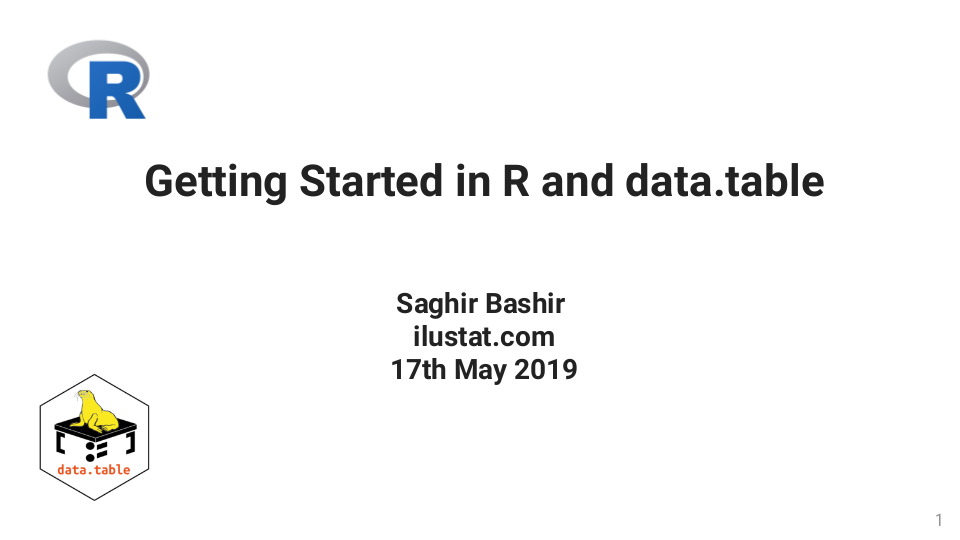

# Overview

> Repsitory of teaching materials for "[Getting Started in R - Tinyverse Edition](https://github.com/eddelbuettel/gsir-te/raw/master/Getting-Started-in-R.pdf)"
workshop (course).

This repository is contains materials for basic R concepts and `data.table` basics 
(~4 hour) workshop. The target audience is R beginners to "intermediate" R users. 
It is ideal for R meetup groups, R user groups or as pre-conference workshop.

# Running the Workshop 

- Use the workshop presentation (HTML):
    + (https://github.com/saghirb/R-datatable-Intro/tree/master/Presentation)
- Share the following zip file with the participants:
    + (https://github.com/saghirb/R-datatable-Intro/raw/master/Share/GSiRdt.zip)
    + Ask them to Unzip
    
## Part 1

- After presenting and demonstrating the basic R concepts:
    + Participants should work through `Share/R-Concepts/Base-R-Exercises.pdf` in the zip file.

## Part 2    

- After presenting and demonstrating the `data.table` basics:
  + Ask the participant to double click on `Share/World-Popn/World-Popn-dt.Rproj` to open
  Rstudio with the right setup.
  + Participants should then work through `Share/World-Popn/World-Population-dt-Exercises.Rmd` 
  in the zip file.
  + Start by knitting the document.
  + Ask them to change the name to their name and knit again.
  
  
## At the End of the Course

- Share the solutions to the World Population exercises (zip file)
    + (https://github.com/saghirb/R-datatable-Intro/raw/master/Share/World-Popn-dt-Solutions.zip)

# Re-creating the Workshop Materials.

Run the [_make.R](https://github.com/saghirb/R-datatable-Intro/blob/master/_make.R) 
script in the R console.

# Why `data.table`?

- `data.table` is a great, high quality and well maintained package with a strong
development team.
- It is **fast** and **memory efficient**. 
    + Including reading and writing data.
- It has no dependencies and works out of the box :)
- Knowing `data.table` will increase your knowledge and understanding of R.
    + I think it is a must have (or must know about) package in your R tool kit.
    + Be brave give it a go :)

For more information see [http://r-datatable.com](http://r-datatable.com)

# Acknowledgements

The materials presented in this repository are complementary to [Getting Started in R - Tinyverse Edition](https://eddelbuettel.github.io/gsir-te/Getting-Started-in-R.pdf) (co-authored with [Dirk
Eddelbuettel](https://github.com/eddelbuettel/))

Thanks to [Matt Dowle](https://github.com/mattdowle), [Arun Srinivasan](https://github.com/arunsrinivasan) and all the `data.table` [team](https://github.com/orgs/Rdatatable/people) and contributors for such a great package.

